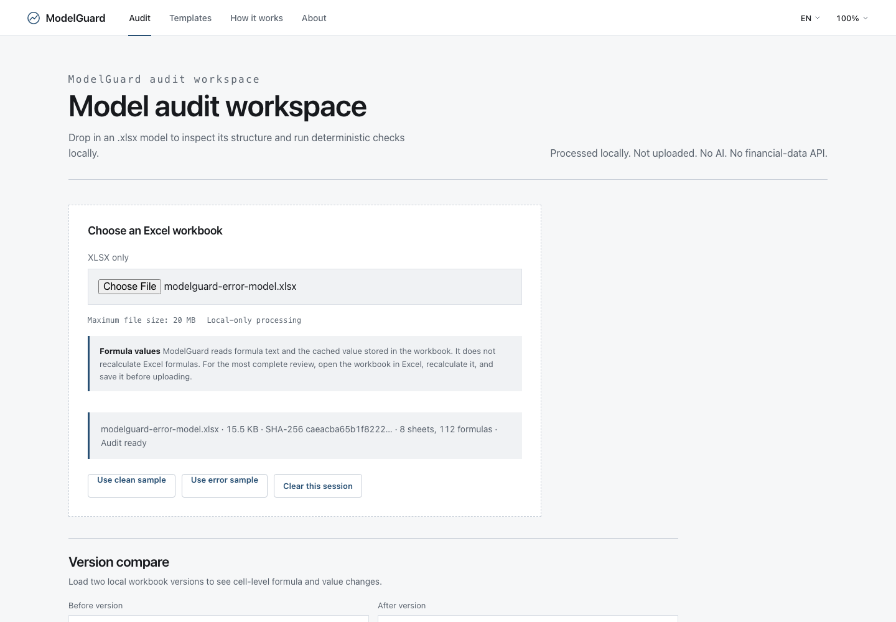
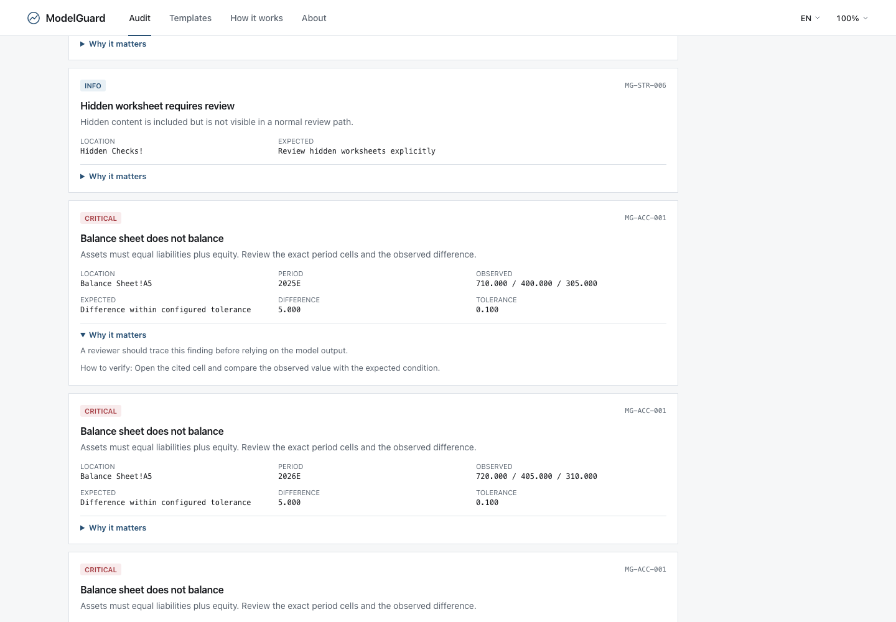
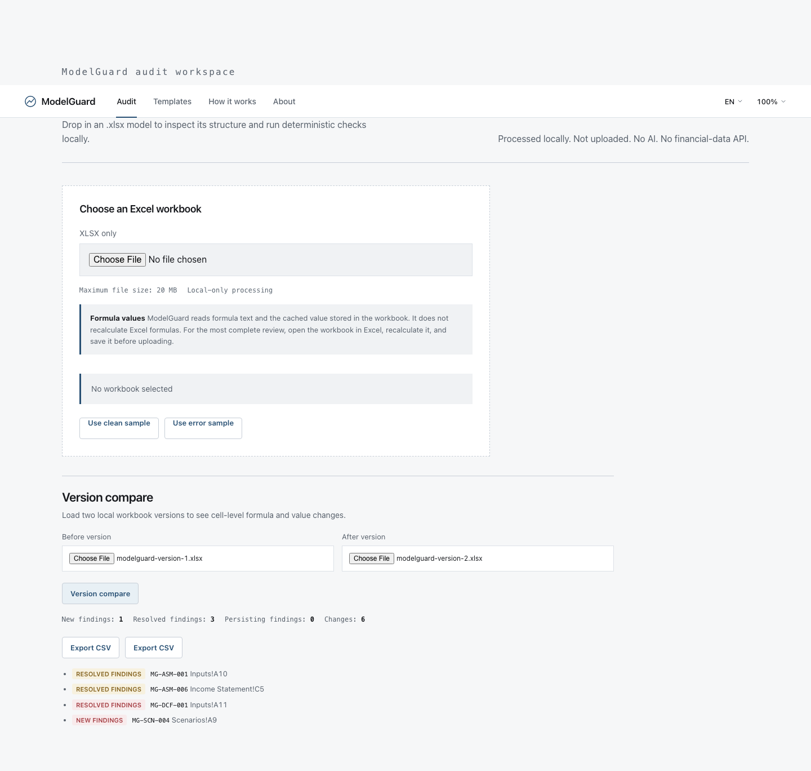
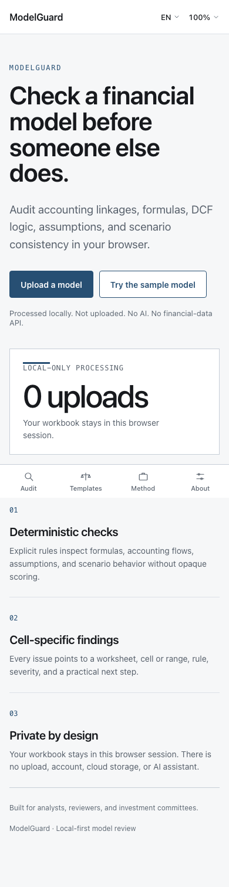

# ModelGuard

## Private financial model audit, in your browser

ModelGuard helps analysts check accounting linkages, formulas, DCF logic, assumptions, and
scenario consistency before a model reaches a reviewer or investment committee.

The existing InvestIQ repository and Vercel project are retained in place. The public product
surface is now ModelGuard; the former market, portfolio, DCA, company research, SEC, and AI
surfaces are retired from the active runtime. The rollback point is the annotated tag
`investiq-v1-before-modelguard`.

[Live demo](https://investiq-eight-xi.vercel.app/) ·
[Repository](https://github.com/changfanghan0324/investiq) ·
[中文说明](README.zh-CN.md)

## Product tour

The public demo is packaged around a local-only audit workflow:










## Privacy contract

- Workbooks are read locally in the browser and parsed in a Web Worker.
- Workbook bytes are never uploaded, stored in a database, placed in browser storage, or sent
  to an AI assistant.
- The production runtime has no market-data provider, SEC API, authentication, analytics,
  upload endpoint, or database dependency.
- Closing or clearing the tab releases the in-memory session. Exports are generated locally.

## Audit workflow

1. Choose an `.xlsx` workbook (20 MB, 50 worksheets, 200,000 non-empty cells, 100,000 formulas,
   and 5,000 named ranges are the current limits).
2. ModelGuard normalizes visible and hidden sheets, formulas, cached values, merged ranges, named
   ranges, and external-link metadata without following external relationships.
3. Deterministic checks produce cell-specific issues with a rule ID, severity, observed value,
   expected condition, and a practical review message.
4. Compare two local workbook versions by cell and export the audit receipt as JSON, CSV, or PDF.

## Rule families

The current catalogue has 38 published rules: 11 spreadsheet/linkage and structure checks, 5
accounting reconciliations, 11 DCF controls, 5 scenario controls, and 6 assumption-governance
checks. The clean golden workbook passes all mapped checks; the error golden workbook
deliberately remains `Needs review`. The catalogue also records scope, tolerance, non-applicability,
false-positive/false-negative risks, remediation, and rule version for every entry.
Every mapped rule reports passed, failed, not-applicable, or cannot-verify rather than filling a
missing value with an inference. See [the full rule catalogue](docs/MODELGUARD_RULE_CATALOG.md).

## Deterministic review and conversational tools

ModelGuard and conversational AI tools serve different review needs. ModelGuard publishes a fixed
rule set, produces the same result for the same workbook, points to cells and periods, and keeps
the workbook and receipt in the local session. A conversational tool can be useful for exploring
questions, drafting explanations, or testing alternative ideas, but its responses are not a
substitute for a cell-level receipt and must be validated against the workbook and its sources.
ModelGuard is intentionally complementary rather than a claim that one workflow replaces the
other.

## Why not just use AI?

ModelGuard is designed for the repeatable, evidence-first part of a model pre-review. A
conversational assistant can still complement it when a reviewer wants exploration or drafting.

| Chat assistant | ModelGuard |
| --- | --- |
| Flexible review | Fixed rule set |
| Prompt-dependent | Repeatable |
| May miss checks | Complete configured checklist |
| General explanation | Sheet/cell-specific evidence |
| Difficult version tracking | Resolved/new/persisting findings |
| Often requires uploading a file | Browser-local processing |

## Historical InvestIQ note

The earlier public demo used synthetic market examples. Its documentation intentionally said:
“Price, comparison, portfolio, and DCA examples use synthetic data.” Those routes are now retired
and redirect to ModelGuard; no synthetic or live market price is rendered by the active product.

## Development

Requirements: Node.js 24.x. Install dependencies with `npm ci` and run:

```bash
npm run dev
npm run typecheck
npm run lint
npm run test
npm run build
```

The static export is configured with `output: "export"`. Vercel redirects preserve old InvestIQ
URLs while keeping the same project and domain.

## Documentation

- [ModelGuard product specification](docs/MODELGUARD_PRODUCT_SPEC.md)
- [Rule catalogue](docs/MODELGUARD_RULE_CATALOG.md)
- [Workbook schema](docs/MODELGUARD_SCHEMA.md)
- [Privacy contract](docs/MODELGUARD_PRIVACY.md)
- [Security model](docs/MODELGUARD_SECURITY.md)
- [Limitations](docs/MODELGUARD_LIMITATIONS.md)
- [Usability walkthroughs](docs/portfolio/MODELGUARD_USABILITY_TESTS.md)
- [Professional-review update](docs/audit/MODELGUARD_REVIEW_UPDATE.md)
- [Parser ADR](docs/architecture/ADR-001-WORKBOOK-PARSER.md)
- [Static/local-only ADR](docs/architecture/ADR-002-STATIC-LOCAL-PROCESSING.md)
- [Migration baseline](docs/audit/MODELGUARD_MIGRATION_BASELINE.md)

ModelGuard is educational review software, not investment, accounting, tax, or legal advice.
