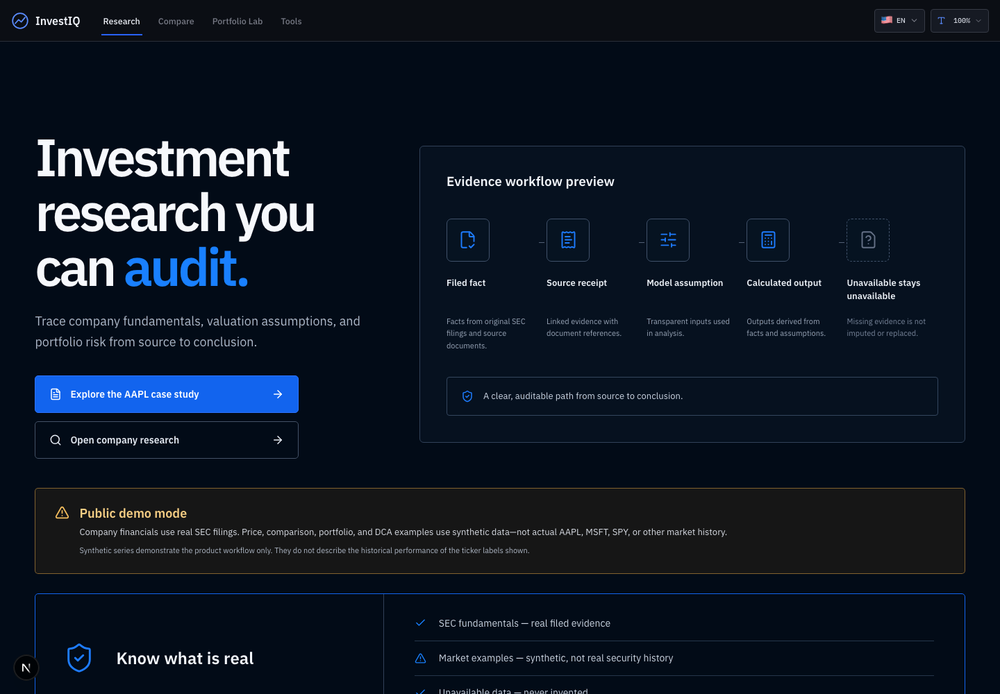

# InvestIQ

## Evidence-first Investment Research & Portfolio Analytics

InvestIQ connects official SEC filing evidence, explicit valuation assumptions, and portfolio-risk
analytics in one reproducible research workflow.

> **Public demo mode:** Company financials use real SEC filings. Price, comparison, portfolio, and
> DCA examples use synthetic data—not actual AAPL, MSFT, SPY, or other market history.

[Live Demo](https://investiq-eight-xi.vercel.app/) ·
[Completed AAPL Research Case](https://investiq-eight-xi.vercel.app/case-study/aapl) ·
[中文说明](README.zh-CN.md)



_English desktop capture · 2026-08-04 · source snapshot `99c1222`._

## Data truth

| Surface | Public deployment source |
| --- | --- |
| Company financials | Real SEC EDGAR filing evidence |
| Filing receipts | Real accession, filing date, and economic period |
| DCF | User-owned assumptions applied to SEC-derived anchors |
| Company price context | Synthetic public-demo series unless licensed live mode is enabled |
| Stock comparison | Synthetic public-demo series on this deployment |
| Portfolio Lab | Synthetic public-demo series on this deployment |
| Historical DCA | Synthetic public-demo series on this deployment |
| AI explanations | Optional; never changes calculations |

Synthetic series demonstrate the workflow only. They do not describe historical performance of the
ticker labels shown.

## The problem

Investment research often separates filing evidence, model assumptions, risk analytics, and the
final memo. That makes lineage hard to audit and allows reported facts to blur into analyst judgment.

## The solution

InvestIQ preserves those boundaries. A researcher can trace a filing fact to its accession and
period, inspect whether a DCF input is reported, constructed, or assumed, test scenarios through
deterministic code, connect securities to portfolio risk, and export a reproducible research output.

## Core workflow

1. Find a US public company and inspect latest-reported SEC evidence.
2. Review five-year financial trends and the filing receipts behind them.
3. Enter and stress explicit DCF assumptions; market price never enters DCF mathematics.
4. Compare 2–5 securities or model 1–10 long-only holdings on a shared evidence mode.
5. Write a memo or print-ready report with facts, assumptions, risks, and limitations separated.
6. Use Historical DCA (1–10 unique holdings) and Market Context as supporting tools.

## Featured AAPL case

The completed case uses Apple FY2025/FY2021–FY2025 SEC evidence, a typed source register, computed
analyst observations, explicit assumption ownership, bear/base/bull DCF reruns, sensitivity
interpretation, official-source catalysts and risks, and an uncertainty-first conclusion. It contains
no public market-price comparison and no recommendation.


_English desktop capture · 2026-08-04 · source snapshot `99c1222`._

## Finance capabilities

- Annual SEC fact selection with economic-period alignment and accession receipts.
- Five-year revenue, operating-margin, earnings, EPS, cash-flow, and constructed-FCF evidence.
- Unlevered FCFF DCF with an explicit EV-to-equity bridge and 5×5 sensitivities.
- Reported, constructed, and analyst-owned assumptions shown as different evidence classes.
- Price/total-return basis selection that never mixes bases within a cross-security analysis.
- CAGR, volatility, Sharpe, Sortino, beta, alpha, historical VaR, drawdown, attribution,
  concentration, correlation, and historical rebalancing scenarios when samples support them.
- Historical DCA accounting with contributions, fees, dividends, taxes, liquidation, TWR, MWRR,
  drawdown, and an auditable ledger. Future DCA is intentionally unavailable.

## Analytics-engineering evidence

- TypeScript/Next.js UI with pure calculation domains and typed source receipts.
- Fail-closed SEC selection, missing-value handling, licensing gates, and security headers.
- Run-level evidence mode prevents licensed-live and synthetic series from being combined.
- Deterministic generated AAPL Markdown with drift tests against the typed case snapshot.
- Vitest contracts, isolated Playwright flows, axe checks, mobile/text-scale checks, and production
  build validation. Exact final counts are recorded in the release PR after CI.

## Public demo limitations

- Public market examples are synthetic and are not actual security history.
- SEC availability and filing taxonomy quality can affect company research.
- Public live-market use remains disabled until display rights and durable provider quota controls
  are approved.
- Sector analytics remain unavailable where no authoritative sector source exists.
- The product provides research and education, not investment advice or suitability assessment.
- No future DCA projection, authentication, or cloud save is provided.
- The downloadable DCA PDF is English-only in this release; the web UI supports English and
  Simplified Chinese.

See [Known Limitations](docs/KNOWN_LIMITATIONS.md) for the complete release-candidate list.

## Architecture

```text
Next.js routes and bilingual UI
  ├─ SEC evidence and source receipts
  ├─ licensed-live or run-pinned synthetic market adapter
  ├─ pure fundamentals, valuation, analytics, and DCA domains
  ├─ memo/report/CSV/PDF output services
  └─ optional AI explanation constrained to calculated summaries
```

Requests are bounded by each workspace: Compare supports 2–5 securities, Portfolio Lab 1–10
holdings, and DCA 1–10 unique holdings. Sequential loading bounds provider request bursts while
supporting each workspace’s stated holding limit.

## Accessibility and language

The UI includes semantic landmarks, keyboard-accessible controls, a skip link, reduced-motion
support, icon-plus-text evidence notices, English/Simplified Chinese catalogs, 320 px layouts, and
text-size settings of 100%, 115%, 130%, and 145%.

## Quick start

Requirements: Node.js 24.x and npm (matching `package.json` and `.nvmrc`).

```bash
npm ci
cp .env.example .env.local
npm run dev
```

SEC research works with a truthful `SEC_USER_AGENT`. Public live-market routes also require provider
credentials, confirmed display rights, and production controls; do not bypass the licensing gate.

```bash
npm run typecheck
npm run lint
npm run test
npm run build
npm run test:e2e
```

## Documentation

- [AAPL written research sample](docs/EQUITY_RESEARCH_SAMPLE_AAPL.md)
- [Methodology](docs/METHODOLOGY.md)
- [Data governance](docs/DATA_GOVERNANCE.md)
- [Financial model contracts](docs/FINANCIAL_MODEL_CONTRACTS.md)
- [SEC selection rules](docs/SEC_SELECTION_RULES.md)
- [Product specification](docs/INVESTIQ_PRODUCT_SPEC.md)
- [AI-assisted development](docs/AI_ASSISTED_DEVELOPMENT.md)
- [Usability protocol](docs/usability/README.md)
- [Release checklist](docs/RELEASE_CHECKLIST.md) and [draft release notes](docs/RELEASE_NOTES_V1.md)
- [License decision](docs/LICENSE_DECISION.md)

## Screenshot gallery

[Home mobile](docs/assets/home-mobile.png) · [AAPL financials](docs/assets/aapl-financials.png) ·
[AAPL valuation](docs/assets/aapl-valuation.png) · [Portfolio demo](docs/assets/portfolio-demo.png) ·
[DCA demo](docs/assets/dca-demo.png)

All analytics captures visibly identify synthetic public-demo data. Captures are dated 2026-08-04
from source snapshot `99c1222`; the release PR records later verification commits separately.

## Author

Built by **Fang Han Chang (Peter Chang)** — finance background and, as of August 2026, incoming
Boston University M.S. in Business Analytics student.

[GitHub](https://github.com/changfanghan0324) ·
[Repository](https://github.com/changfanghan0324/investiq) ·
[Methodology](https://investiq-eight-xi.vercel.app/methodology)

LinkedIn, public email, and résumé links are intentionally omitted until the owner verifies and
approves them.

## License and release status

No open-source license has been granted. Unless and until the owner selects a license, all rights are
reserved; third-party data and vendor rights are excluded. See [License Decision](docs/LICENSE_DECISION.md).

This branch is a **v1.0 release candidate**, not a final release. No tag, release, or merge is implied.
Owner license approval, participant testing, preview/CI review, merge approval, and release approval
remain manual gates.
