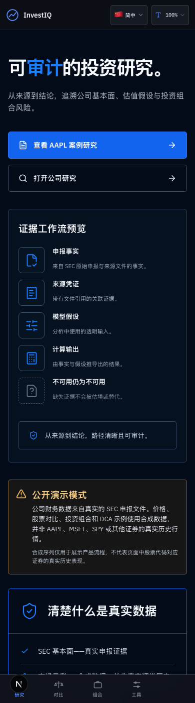
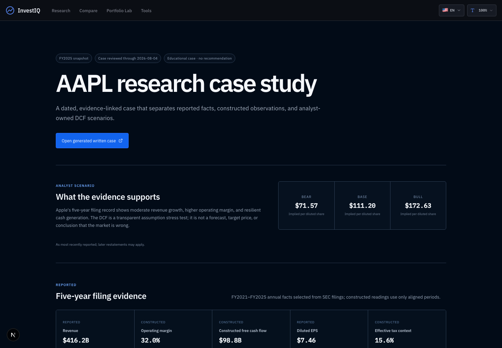

# InvestIQ

## 以证据为先的投资研究与投资组合分析平台

InvestIQ 在一个可复现的研究流程中连接 SEC 官方申报证据、明确的估值假设与投资组合风险分析。

> **公开演示模式：**公司财务数据来自真实的 SEC 申报文件。价格、股票对比、投资组合和 DCA
> 示例使用合成数据，并非 AAPL、MSFT、SPY 或其他证券的真实历史行情。

[在线演示](https://investiq-eight-xi.vercel.app/) ·
[完整 AAPL 研究案例](https://investiq-eight-xi.vercel.app/case-study/aapl) ·
[English](README.md)



_移动端截图 · 2026-08-04 · 来源快照 `99c1222`。_

## 数据事实

| 页面 | 公开部署的数据来源 |
| --- | --- |
| 公司财务 | 真实 SEC EDGAR 申报证据 |
| 申报回执 | 真实 accession、申报日期与经济期间 |
| DCF | 用户自有假设应用于 SEC 衍生锚点 |
| 公司价格情境 | 未启用有授权 live 模式时使用合成公开演示序列 |
| 股票对比 | 本部署使用合成公开演示序列 |
| Portfolio Lab | 本部署使用合成公开演示序列 |
| Historical DCA | 本部署使用合成公开演示序列 |
| AI 解释 | 可选；绝不改变计算 |

合成序列仅用于展示产品流程，不代表页面中股票代码对应证券的真实历史表现。

## 问题与方案

传统研究常把申报证据、模型假设、风险分析和最终备忘录分开，导致数据血缘难以审计，也容易混淆
reported facts 与 analyst judgment。InvestIQ 保留这些边界：事实可追溯至 accession 与期间；DCF
输入明确标为 reported、constructed 或 analyst assumption；情境由确定性代码计算；输出同时保留风险与限制。

## 核心流程

1. 搜索美国上市公司并查看最新申报口径的 SEC 证据。
2. 检查五年财务趋势及其 filing receipts。
3. 输入并压力测试明确的 DCF 假设；市场价格不进入 DCF 数学。
4. 对比 2–5 只证券，或分析 1–10 个 long-only holdings；同一次分析固定一种数据模式。
5. 输出事实、假设、风险与限制分离的 memo 或可打印 report。
6. 使用 Historical DCA（1–10 个不重复 holdings）与 Market Context 作为辅助工具。

## AAPL 完整案例

案例使用 Apple FY2025 及 FY2021–FY2025 SEC 证据、typed source register、由证据计算的观察、明确
的假设所有权、bear/base/bull DCF 重跑、敏感性解释及官方来源的 catalysts 和 risks。案例没有公开
market-price comparison，也不提供投资建议。



## 财务与工程能力

- 按经济期间选择 SEC 年度事实，并保留 accession receipts。
- 五年 revenue、operating margin、earnings、EPS、cash flow 与 constructed FCF。
- Unlevered FCFF DCF、明确的 EV-to-equity bridge 与 5×5 sensitivity。
- Price/total-return basis 不在跨证券分析中混用。
- 样本足够时提供 CAGR、volatility、Sharpe、Sortino、beta、alpha、historical VaR、drawdown、
  attribution、concentration 与 correlation。
- DCA 支持 contributions、fees、dividends、taxes、liquidation、TWR、MWRR 与 audit ledger；
  不提供未来 DCA 预测。
- TypeScript/Next.js、纯计算 domain、typed receipts、fail-closed missing data 与 licensing gate。
- Vitest、隔离 Playwright、axe、移动端、文字缩放和 production build 验证；最终数量记录于 PR。

## 公开演示限制

- 公开市场示例为合成数据，不是真实证券历史。
- SEC 可用性和 filing taxonomy 会影响公司研究。
- 未批准公开展示权及 durable provider quota 前，不启用公开 live-market 数据。
- 缺少权威 sector source 时不显示 sector analytics。
- 本产品用于研究与教育，不构成投资建议或 suitability assessment。
- 不提供 future DCA、登录或云端保存。
- 本版本网页支持英文/简体中文，但 DCA PDF 正文仅为英文。

完整内容见[已知限制](docs/KNOWN_LIMITATIONS.md)。

## 架构与范围

```text
Next.js 双语界面
  ├─ SEC 证据与 source receipts
  ├─ licensed-live 或 run-pinned synthetic market adapter
  ├─ 纯 fundamentals / valuation / analytics / DCA domains
  ├─ memo / report / CSV / PDF outputs
  └─ 只解释已计算摘要的可选 AI
```

Compare 支持 2–5 只证券，Portfolio Lab 支持 1–10 个 holdings，DCA 支持 1–10 个不重复
holdings。文字大小为 100%、115%、130%、145%，支持 320 px 布局、键盘、reduced motion 与 `html lang` 切换。

## 本地运行与验证

需要 Node.js 24.x 与 npm（与 `package.json` 和 `.nvmrc` 一致）。

```bash
npm ci
cp .env.example .env.local
npm run dev
```

SEC 路径需要真实的 `SEC_USER_AGENT`。公开 live-market 路径还需要 provider credentials、已确认的
display rights 与 production controls；不得绕过 licensing gate。

```bash
npm run typecheck
npm run lint
npm run test
npm run build
npm run test:e2e
```

## 文件

- [AAPL 书面研究样本](docs/EQUITY_RESEARCH_SAMPLE_AAPL.md)
- [方法论](docs/METHODOLOGY.md)
- [数据治理](docs/DATA_GOVERNANCE.md)
- [财务模型合同](docs/FINANCIAL_MODEL_CONTRACTS.md)
- [SEC 选择规则](docs/SEC_SELECTION_RULES.md)
- [产品规格](docs/INVESTIQ_PRODUCT_SPEC.md)
- [AI 协作说明](docs/AI_ASSISTED_DEVELOPMENT.md)
- [真人可用性测试协议](docs/usability/README.md)
- [发布检查表](docs/RELEASE_CHECKLIST.md)与[发布说明草案](docs/RELEASE_NOTES_V1.md)
- [License 决策](docs/LICENSE_DECISION.md)

## 作者、License 与发布状态

作者：**Fang Han Chang（Peter Chang）**。金融背景；截至 2026 年 8 月，即将就读 Boston University
M.S. in Business Analytics。[GitHub](https://github.com/changfanghan0324) ·
[Repository](https://github.com/changfanghan0324/investiq) ·
[Methodology](https://investiq-eight-xi.vercel.app/methodology)

LinkedIn、公开 email 与 résumé 在 owner 核准前不显示。当前未授予开源 license；owner 选择前保留
所有权利，且不包含第三方数据与 vendor rights。本分支是 **v1.0 release candidate**，不是正式发布；
不得据此视为已 merge、tag 或 release。
